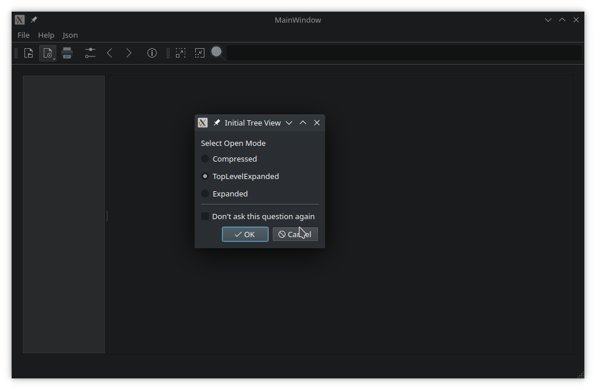

# Document Viewer

<div align="center">



**Professional cross-platform document viewing application built with Qt 6**

[](https://www.qt.io/)
[](https://isocpp.org/)
[](LICENSE)
[]()

</div>

## 📋 Overview

**Document Viewer** is a powerful Qt Widgets-based application for viewing and editing various document types with an extensible plugin architecture. The project demonstrates Qt development best practices, including plugin systems, settings management, print system integration, and professional user interface design.

## ✨ Key Features

### 🔌 Plugin Architecture
- **Extensible System**: Easily add support for new file formats
- **Dynamic Loading**: Plugins are loaded automatically at startup
- **Unified Interface**: All plugins implement the common `ViewerInterface` API

### 📄 Supported Formats

#### 📝 Text Editor (TxtViewer)
- View and edit text files
- Copy/cut/paste operations
- Save changes
- Print documents

#### 🖼️ Image Viewer (ImageViewer)
- Support for all `QImageReader` formats
- Automatic scaling of large images
- High DPI display optimization
- Support for PNG, JPEG, BMP, GIF and other formats

#### 📊 JSON Viewer (JsonViewer)
- Tree-view JSON structure representation
- Bookmark navigation
- Search by keys and values
- Interactive tree node management
- JSON data editing

#### 📕 PDF Viewer (PdfViewer)
- Smooth scrolling with `QScroller`
- Bookmark navigation
- Page thumbnails
- Zoom and view controls
- PDF document printing

#### 🎮 3D Viewer (Q3DViewer)
- 3D model viewing
- Qt Quick 3D integration
- Interactive navigation

### 🛠️ Additional Features

- **File History**: Automatic saving of recently opened files list
- **Settings**: Window state and viewer parameters persistence using `QSettings`
- **Printing**: Full document printing support (requires Qt PrintSupport)
- **Menus and Toolbars**: Dynamic menus and toolbars for each document type
- **Cursors**: Intelligent cursor management on hover

## 🚀 Quick Start

### Requirements

- **Qt 6.8** or newer
- **CMake 3.16** or newer
- **C++17 compiler**

#### Additional Qt Modules:
- `Qt6::Core` (required)
- `Qt6::Gui` (required)
- `Qt6::Widgets` (required)
- `Qt6::PrintSupport` (optional, for printing)
- `Qt6::Pdf` (optional, for PDF viewing)
- `Qt6::PdfWidgets` (optional, for PDF viewing)
- `Qt6::Quick3D` (optional, for 3D viewer)

### Building the Project

#### Option 1: Using Qt Creator
1. Open `CMakeLists.txt` in Qt Creator
2. Configure the project with the appropriate kit
3. Click **Build** (Ctrl+B)
4. Run the application (Ctrl+R)

#### Option 2: Command Line

```bash
# Create build directory
mkdir build
cd build

# Configure with CMake
cmake .. -DCMAKE_PREFIX_PATH=/path/to/Qt/6.x.x/compiler

# Build the project
cmake --build .

# Run the application
./app/documentviewer  # Linux/macOS
# or
app\documentviewer.exe  # Windows
```

### Installation

After successful build, you can install the application:

```bash
cmake --install . --prefix /installation/path
```

## 📖 Usage

### Opening Files

**Method 1**: Via menu
```
File → Open... (Ctrl+O)
```

**Method 2**: From command line
```bash
documentviewer /path/to/file.pdf
```

**Method 3**: Via recent files list
```
File → Recent Files → select file
```

### Navigation

- **PDF/Images**: Use mouse wheel or navigation buttons
- **JSON**: Tree navigation, use bookmarks
- **Text**: Standard editing

### Keyboard Shortcuts

| Action | Shortcut |
|--------|----------|
| Open File | `Ctrl+O` |
| Print | `Ctrl+P` |
| Zoom In | `Ctrl++` |
| Zoom Out | `Ctrl+-` |
| Help | `F1` |

## 🏗️ Project Architecture

```
documentviewer/
├── app/                          # Main application
│   ├── main.cpp                  # Entry point
│   ├── mainwindow.*              # Main window
│   ├── abstractviewer.*          # Base class for viewers
│   ├── viewerfactory.*           # Plugin factory
│   ├── viewerinterfaces.h        # Plugin interfaces
│   ├── recentfiles.*             # Recent files management
│   ├── recentfilemenu.*          # Recent files menu
│   └── images/                   # Icon resources
│
├── plugins/                      # Viewer plugins
│   ├── txtviewer/               # Text editor
│   ├── imageviewer/             # Image viewer
│   ├── jsonviewer/              # JSON viewer
│   ├── pdfviewer/               # PDF viewer
│   │   ├── hoverwatcher.*       # Cursor management
│   │   └── zoomselector.*       # Zoom selector
│   └── q3dviewer/               # 3D viewer
│
├── doc/                          # Documentation
│   └── src/                     # Qt documentation sources
│
└── CMakeLists.txt               # Build configuration
```

## 🔧 Creating Your Own Plugin

### Step 1: Create Plugin Class

```cpp
#include "viewerinterfaces.h"

class MyViewer : public ViewerInterface
{
    Q_OBJECT
    Q_PLUGIN_METADATA(IID "org.qt-project.Qt.Examples.DocumentViewer.ViewerInterface" 
                      FILE "myviewer.json")
    Q_INTERFACES(ViewerInterface)
    
public:
    // Implement ViewerInterface
    void init(QFile *file, QWidget *parent, QMainWindow *mainWindow) override;
    QString viewerName() const override;
    QStringList supportedMimeTypes() const override;
    bool hasContent() const override;
    // ... other methods
};
```

### Step 2: Create JSON Metadata

```json
{
    "Name": "MyViewer",
    "Description": "Your plugin description",
    "Version": "1.0",
    "MimeTypes": ["application/x-custom"]
}
```

### Step 3: Add CMakeLists.txt

```cmake
qt_add_plugin(myviewer)
target_sources(myviewer PRIVATE myviewer.cpp myviewer.h)
target_link_libraries(myviewer PRIVATE Qt6::Widgets)
```

### Step 4: Register in Main CMakeLists.txt

```cmake
add_subdirectory(plugins/myviewer)
```

## 🎯 Key Components

### ViewerInterface
Base interface for all document viewing plugins.

### AbstractViewer
Abstract class with common functionality for creating viewers.

### ViewerFactory
Manages loading and creating plugin instances.

### HoverWatcher
Singleton class for cursor management on widget hover.

### RecentFiles
Specialized `QStringList` for managing recent files list.

## 🤝 Contributing

We welcome contributions to the project! Please see [CONTRIBUTING.md](CONTRIBUTING.md) for details.

### How to Contribute

- 🐛 Report bugs via [Issues](../../issues)
- 💡 Suggest new features
- 🔧 Submit Pull Requests with improvements
- 📖 Improve documentation
- ⭐ Star the project on GitHub!

## 📝 License

This project is licensed under the **BSD 3-Clause License**. See [LICENSE](LICENSE) file for details.

```
Copyright (C) 2023 The Qt Company Ltd.
SPDX-License-Identifier: LicenseRef-Qt-Commercial OR BSD-3-Clause
```

## 🔗 Useful Links

- [Official Qt Documentation](https://doc.qt.io/)
- [Qt Wiki](https://wiki.qt.io/)
- [Qt Forum](https://forum.qt.io/)
- [Qt Source Code](https://code.qt.io/)

## 📞 Contact and Support

- **Questions**: Create an [Issue](../../issues)
- **Discussions**: Use [Discussions](../../discussions)
- **Email**: [your-email@example.com]

## 🌟 Implementation Highlights

### Settings Management
The application uses `QSettings` to save:
- Window size and position
- Working directory
- Recent files list
- Individual viewer settings

### Plugin System
- Uses Qt Plugin System
- Automatic plugin discovery
- Dynamic library loading
- Interface compatibility checking

### Performance Optimization
- Lazy content loading
- Thumbnail caching
- Asynchronous loading for large files
- Memory management optimization

## 📊 Development Status

- [x] Base architecture
- [x] Text editor
- [x] Image viewer
- [x] JSON viewer
- [x] PDF viewer
- [x] 3D viewer
- [x] Printing system
- [ ] Dark theme support
- [ ] Markdown plugin
- [ ] Export to various formats
- [ ] Cross-session bookmarks

## 🙏 Acknowledgments

This project is based on official Qt examples and demonstrates best practices for Qt 6 application development.

---

<div align="center">

**Made with ❤️ using Qt Framework**

[⬆ Back to Top](#document-viewer)

</div>
